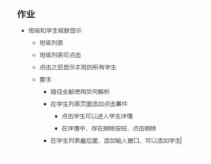

+   不至于返回空白页面

+ {{forloop}}   选择对应的下标

+ 快捷键
  + ctrl + D 复制一行插入到下面
  + +alt+shift +↑↓ 将一行上下移动
  
+ 整理代码
  
+ code-> Reformat Code
  
+ html注释   
  + {#XXXX#}  
  +  <!---->  
  +   段落注释   ctrl+/
  
+ 加法{{value | add : ±a}}

+ 乘法

+ 整除

  + 如果相等
    
      ```html
    
    	  		语句
    
      			语句
    
     			语句
    
    ```

+   如果不相等
	
	+ ifnotequal
+ url反向解析
	
	+ 
+ csrf_token 用于跨站请求伪造保护的
	
	+ 
+ 过滤器{{var|过滤器}}
	+ 转小写{{value：lower}}
	+ 转大写{{value：upper}}


+ html转义
	+ {{code(需转义的代码) | safe}}
+ 不想转义
	+ 
         {{ code }}
      


+ 模板继承（尽量使用block+include)
	
	+ 关键字block:挖坑
	  	+ 
	   	 		          code
	       
	
	  	+ 第一次出现：代表规划
	  
	  	+ 第二次出现：代表填充规划
	  
	  	+ 第三次出现：代表覆盖之前规划       如不想覆盖加一行{{block.super}}
	  
	+ extends 继承卸载开头位置
		+ 
			+ block+extends 化整为零
	+ include：加载模板进行渲染 可以将页面作为一部分嵌入到其他页面
		+ 
			+ include+block 由零聚一
	+ 如果继承自一个父模板，自己直接重写的页面结构式不生效的，只能在已有的父模板中填充


+ 静态资源
	+ 动静分离
	+ 创建静态文件夹
	+ 在settings中注册staticfiles_dirs = []
	+ 在模板中使用 先加载静态资源
	+ 使用 
	+ 仅在debug模式可以使用
	
+ 视图view
	+ 路由器：按照列表的书写顺序进行匹配的，从上到下匹配，没有最优匹配的概念
	+ 路由规则编写： 通常直接指定以^开头，在结尾处直接添加反斜线
	+ 路由路径中的参数使用()进行获取 一个()对应视图函数中的一个参数
		+ 参数 路径参数 位置参数：按照书写顺序进行匹配  关键字参数：按照参数名称匹配与顺序无关（？P<name>\d+）


+ locals() 
	+ 将局部变量使用字典的方式进行大包，key变量名，values变量数据

+ 反向解析:根据根路由中注册的namespace 和在子路由中注册的name，这两个参数来动态获取路径
		+ 
+ 
	
+ 在templates中添加相对应的html访问就会与之对应，如添加404.html，若出错，就近原则寻找开发者写的404  关闭DUEBUG模式


+ 双R    Request  Response
	+ request 内置属性  
		+ method 
		
		+ path  
		
		+ GET    类属性结构 一个key对应多个值，get  getlist 
		
		+ POST   
		
		+ META（各种客户端元信息，REMOTE_ADDR->客户端IP地址）



